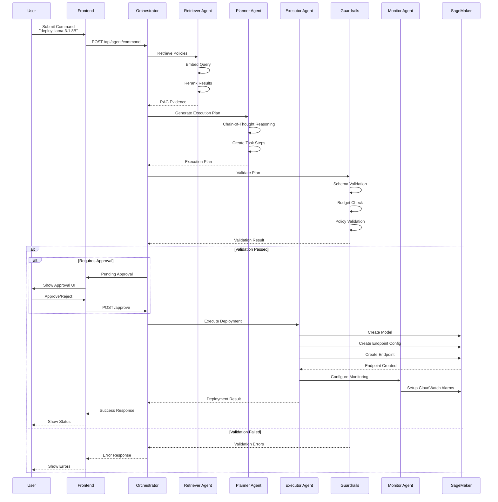
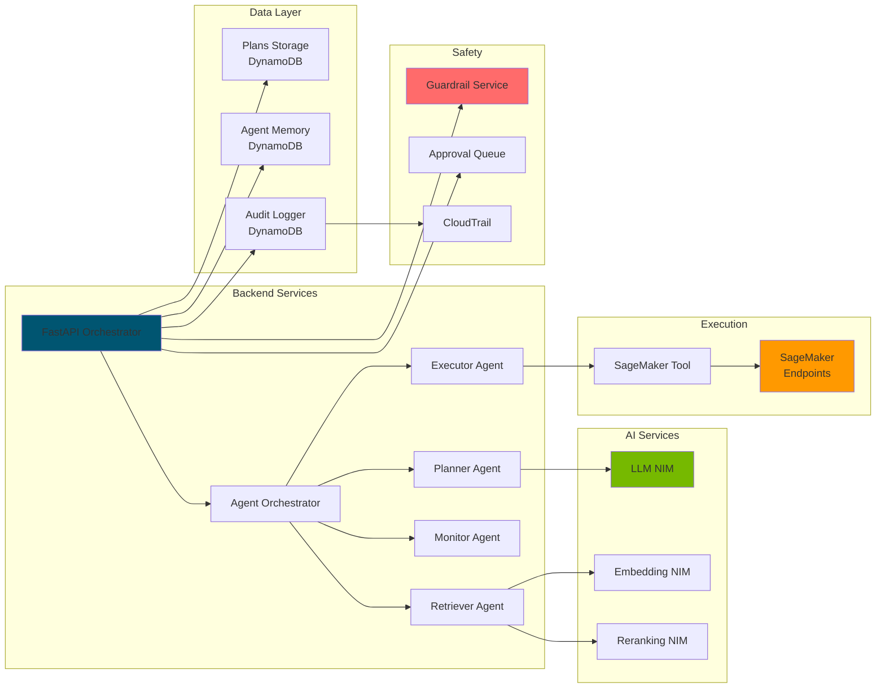

# 🤖 AgentOps - Autonomous Model Deployment System

<div align="center">


[🚀 Features](#-features) • [📖 Installation](#-installation) • [🏗️ Architecture](#️-architecture) • [📚 Documentation](#-documentation) • [🤝 Contributing](#-contributing)

</div>

---

## 📋 Table of Contents

- [Overview](#-overview)
- [Features](#-features)
- [Architecture](#️-architecture)
- [Installation](#-installation)
- [Quick Start](#-quick-start)
- [Configuration](#-configuration)
- [API Reference](#-api-reference)
- [Deployment](#-deployment)
- [Development](#-development)
- [Testing](#-testing)
- [Contributing](#-contributing)
- [License](#-license)

---

## 🎯 Overview

**AgentOps** is an **autonomous, safety-first MLOps orchestrator** that enables intelligent deployment of AI/ML models to Amazon SageMaker using natural language commands. The system leverages **NVIDIA NIMs** (NVIDIA Inference Microservices) for LLM reasoning and RAG (Retrieval-Augmented Generation), implementing a three-layer safety framework for production-grade autonomous operations.

### Key Highlights

- 🧠 **Agentic AI Architecture**: Multi-agent system with Planner, Executor, Monitor, and Retriever agents
- 🔒 **Safety-First Design**: Three-layer guardrails (Validation, Human-in-the-Loop, Immutable Audit)
- 📝 **Natural Language Interface**: Deploy models using simple commands like "deploy llama-3.1 8B for chatbot-x"
- 🔄 **Autonomous Orchestration**: AI agents automatically generate deployment configurations with reasoning
- 📊 **Real-Time Dashboard**: Beautiful React UI with live monitoring, workflow visualization, and agent logs
- 🛡️ **Enterprise-Grade**: Comprehensive audit logging, immutable trails, and production-ready infrastructure

---

## ✨ Features

### Core Capabilities

- **🎯 Natural Language Deployment**
  - Convert human intent into structured deployment plans
  - Support for complex multi-step workflows
  - Intelligent command parsing and execution

- **🧠 Agentic AI System**
  - **Planner Agent**: Generates execution plans with chain-of-thought reasoning
  - **Executor Agent**: Handles deployment execution with ReAct pattern
  - **Monitor Agent**: Tracks deployment health and triggers rollbacks
  - **Retriever Agent**: RAG-powered policy retrieval for grounded decisions

- **🔄 Agent Memory System**
  - Episodic memory for learning from past deployments
  - Semantic memory for pattern recognition
  - DynamoDB persistence with automatic TTL

- **📊 Real-Time Dashboard**
  - Workflow Designer with ReactFlow visualization
  - Agent execution logs with reasoning chains
  - Deployment status tracking and metrics
  - Dark/Light mode support

- **🛡️ Safety Layers**
  - **Layer 1**: Guardrails with schema, budget, and policy validation
  - **Layer 2**: Human-in-the-Loop approvals for production deployments
  - **Layer 3**: Immutable audit trail via DynamoDB + CloudTrail + S3 Object Lock

- **🔍 RAG-Powered Decision Making**
  - Two-stage retrieval (embedding + reranking) using NeMo Retriever NIM
  - Policy-grounded deployments
  - Context-aware planning

---

## 🏗️ Architecture

### System Architecture Diagram

```mermaid
graph TB
    subgraph "Frontend Layer"
        UI[React Dashboard<br/>Workflow Designer]
        API_CLIENT[API Client<br/>React Query]
    end

    subgraph "API Gateway"
        FASTAPI[FastAPI Orchestrator<br/>REST API]
    end

    subgraph "Agent Orchestrator"
        ORCHESTRATOR[Agent Orchestrator<br/>Multi-Agent Coordination]
        PLANNER[Planner Agent<br/>Chain-of-Thought]
        EXECUTOR[Executor Agent<br/>ReAct Pattern]
        MONITOR[Monitor Agent<br/>Health Tracking]
        RETRIEVER[Retriever Agent<br/>RAG Engine]
    end

    subgraph "NVIDIA NIM Services"
        LLM_NIM[llama-3.1-nemotron-nano-8B-v1<br/>LLM NIM]
        EMBED_NIM[NeMo Retriever<br/>Embedding NIM]
        RERANK_NIM[NeMo Retriever<br/>Reranking NIM]
    end

    subgraph "AWS Services"
        SAGEMAKER[SageMaker<br/>Model Endpoints]
        DYNAMODB[DynamoDB<br/>Plans & Audit Logs]
        S3[S3 Bucket<br/>CloudTrail Logs]
        CLOUDTRAIL[CloudTrail<br/>Immutable Audit]
    end

    subgraph "Safety Layers"
        GUARDRAILS[Guardrail Service<br/>Validation]
        APPROVAL[HITL Approval<br/>Queue]
        AUDIT[Audit Logger<br/>Immutable Trail]
    end

    UI --> API_CLIENT
    API_CLIENT --> FASTAPI
    FASTAPI --> ORCHESTRATOR
    ORCHESTRATOR --> PLANNER
    ORCHESTRATOR --> EXECUTOR
    ORCHESTRATOR --> MONITOR
    ORCHESTRATOR --> RETRIEVER
    
    PLANNER --> LLM_NIM
    RETRIEVER --> EMBED_NIM
    RETRIEVER --> RERANK_NIM
    
    FASTAPI --> GUARDRAILS
    FASTAPI --> APPROVAL
    FASTAPI --> AUDIT
    
    EXECUTOR --> SAGEMAKER
    AUDIT --> DYNAMODB
    AUDIT --> CLOUDTRAIL
    CLOUDTRAIL --> S3
    
    GUARDRAILS -.-> SAGEMAKER
    MONITOR -.-> SAGEMAKER

    style UI fill:#61DAFB
    style FASTAPI fill:#005571
    style LLM_NIM fill:#76B900
    style SAGEMAKER fill:#FF9900
    style DYNAMODB fill:#232F3E
    style GUARDRAILS fill:#FF6B6B
```



### Agent Workflow Diagram



### Component Architecture



---

## 📦 Installation

### Prerequisites

- **Python 3.11+** - [Download Python](https://www.python.org/downloads/)
- **Node.js 18+** - [Download Node.js](https://nodejs.org/)
- **AWS Account** with appropriate permissions
- **AWS CLI** configured - [Install AWS CLI](https://aws.amazon.com/cli/)
- **Git** - [Download Git](https://git-scm.com/downloads)

### Step 1: Clone the Repository

```bash
git clone https://github.com/ashutosh0x/AgentOps-AWS.git
cd AgentOps-AWS
```

### Step 2: Backend Setup

#### Option A: Using Setup Script (Recommended)

```bash
# Linux/macOS
bash scripts/setup_dev.sh

# Windows PowerShell
.\scripts\setup_dev.sh
```

#### Option B: Manual Setup

```bash
# Create virtual environment
python -m venv venv

# Activate virtual environment
# Linux/macOS:
source venv/bin/activate
# Windows:
venv\Scripts\activate

# Install dependencies
pip install -r requirements.txt
```

### Step 3: Frontend Setup

```bash
cd frontend

# Install dependencies
npm install

# For development
npm run dev

# For production build
npm run build
```

### Step 4: Configure Environment Variables

Create a `.env` file in the root directory:

```bash
cp .env.example .env  # If .env.example exists
```

Edit `.env` with your configuration:

```env
# AWS Configuration (Required)
AWS_REGION=us-east-1
AWS_ACCESS_KEY_ID=your-access-key
AWS_SECRET_ACCESS_KEY=your-secret-key

# SageMaker Endpoints (Required - Deploy via SageMaker JumpStart)
LLM_ENDPOINT=llama-3.1-nemotron-nano-8b-v1-endpoint
RETRIEVER_EMBED_ENDPOINT=nemo-retriever-embed-endpoint
RETRIEVER_RERANK_ENDPOINT=nemo-retriever-rerank-endpoint

# DynamoDB (Optional - Auto-created if not exists)
DYNAMODB_TABLE_NAME=agentops-audit-log
DYNAMODB_PLANS_TABLE_NAME=agentops-plans
DYNAMODB_MEMORY_TABLE_NAME=agentops-agent-memory

# Execution Mode (Safety)
EXECUTE=false  # Set to "true" for actual deployments (default: false for safety)

# Frontend (Optional)
VITE_API_URL=http://localhost:8000

# Agent Memory (Optional)
AGENT_MEMORY_EXPIRATION_DAYS=90
```

### Step 5: Deploy NVIDIA NIMs on SageMaker

#### Using SageMaker JumpStart

1. Open [AWS SageMaker Console](https://console.aws.amazon.com/sagemaker/)
2. Navigate to **JumpStart**
3. Search for **"llama-3.1-nemotron-nano-8B-v1"**
4. Deploy to endpoint and note the endpoint name
5. Repeat for **NeMo Retriever Embedding** and **Reranking** NIMs
6. Update `.env` with endpoint names

#### Using AWS Marketplace

1. Subscribe to NVIDIA NIM microservices
2. Deploy via SageMaker
3. Note endpoint names

### Step 6: Upload Policy Documents (Optional)

```bash
python scripts/upload_docs.py
```

This ingests sample policies into the retriever for RAG grounding.

---

## 🚀 Quick Start

### Start Backend Server

```bash
# Activate virtual environment first
source venv/bin/activate  # Linux/macOS
# or
venv\Scripts\activate  # Windows

# Start FastAPI server
uvicorn orchestrator.main:app --reload --host 0.0.0.0 --port 8000

# Or using Make
make dev
```

The API will be available at `http://localhost:8000`
- API Documentation: `http://localhost:8000/docs`
- Health Check: `http://localhost:8000/health`

### Start Frontend Server

```bash
cd frontend
npm run dev
```

The dashboard will be available at `http://localhost:5173`

### Test the System

```bash
# Run demo script
bash demo/demo.sh

# Or using Make
make demo
```

---

## ⚙️ Configuration

### Environment Variables

| Variable | Required | Default | Description |
|----------|----------|---------|-------------|
| `AWS_REGION` | Yes | - | AWS region for deployments |
| `LLM_ENDPOINT` | Yes* | - | SageMaker endpoint for LLM NIM |
| `RETRIEVER_EMBED_ENDPOINT` | Yes* | - | SageMaker endpoint for NeMo Retriever Embedding |
| `RETRIEVER_RERANK_ENDPOINT` | Yes* | - | SageMaker endpoint for NeMo Retriever Reranking |
| `DYNAMODB_TABLE_NAME` | No | `agentops-audit-log` | DynamoDB table for audit logs |
| `DYNAMODB_PLANS_TABLE_NAME` | No | `agentops-plans` | DynamoDB table for deployment plans |
| `DYNAMODB_MEMORY_TABLE_NAME` | No | `agentops-agent-memory` | DynamoDB table for agent memory |
| `EXECUTE` | No | `false` | Enable actual deployments (set to `true` carefully) |
| `VITE_API_URL` | No | `http://localhost:8000` | Backend API URL for frontend |
| `AGENT_MEMORY_EXPIRATION_DAYS` | No | `90` | TTL for agent memory entries |

*Can use mock mode if endpoints not configured

### IAM Permissions

Minimum required IAM permissions:

```json
{
  "Version": "2012-10-17",
  "Statement": [
    {
      "Effect": "Allow",
      "Action": [
        "sagemaker:CreateModel",
        "sagemaker:CreateEndpointConfig",
        "sagemaker:CreateEndpoint",
        "sagemaker:DescribeModel",
        "sagemaker:DescribeEndpointConfig",
        "sagemaker:DescribeEndpoint",
        "sagemaker:InvokeEndpoint",
        "sagemaker:DeleteModel",
        "sagemaker:DeleteEndpointConfig",
        "sagemaker:DeleteEndpoint",
        "dynamodb:PutItem",
        "dynamodb:GetItem",
        "dynamodb:Query",
        "dynamodb:Scan",
        "dynamodb:DeleteItem",
        "dynamodb:CreateTable",
        "dynamodb:DescribeTable",
        "s3:GetObject",
        "s3:PutObject",
        "cloudwatch:PutMetricData",
        "cloudwatch:GetMetricStatistics"
      ],
      "Resource": "*"
    }
  ]
}
```

---

## 📚 API Reference

### Core Endpoints

#### `POST /api/agent/command`

Submit a natural language deployment command.

**Request:**
```json
{
  "command": "deploy llama-3.1 8B for chatbot-x",
  "user_id": "alice@example.com",
  "env": "staging",
  "constraints": {
    "budget_usd_per_hour": 15.0
  }
}
```

**Response:**
```json
{
  "command_id": "uuid",
  "status": "success",
  "result": {
    "plan_id": "uuid",
    "status": "deploying",
    "artifact": {
      "endpoint_name": "chatbot-x-staging",
      "model_name": "llama-3.1-8b",
      "instance_type": "ml.m5.large",
      "instance_count": 1
    }
  }
}
```

#### `GET /api/deployments`

List all deployment plans.

**Response:**
```json
{
  "deployments": [
{
  "plan_id": "uuid",
      "status": "deployed",
      "intent": "deploy llama-3.1 8B",
      "env": "staging",
      "created_at": "2024-01-01T00:00:00Z"
    }
  ],
  "count": 1
}
```

#### `GET /plan/{plan_id}`

Get detailed deployment plan with reasoning steps.

**Response:**
```json
{
  "plan": {
  "plan_id": "uuid",
    "status": "deployed",
    "reasoning_steps": [
      {
        "step_id": "uuid-step-1",
        "agent_type": "planner",
        "action": "generate_config",
        "status": "completed",
        "reasoning_chain": {
          "agent_name": "Planner Agent",
          "steps": [
            {
              "thought": "Planning deployment...",
              "reasoning": "Generated configuration",
              "confidence": 0.85
            }
          ]
        }
      }
    ]
  }
}
```

#### `POST /api/deployments/{plan_id}/pause`

Pause a running deployment.

#### `POST /api/deployments/{plan_id}/restart`

Restart a paused or failed deployment.

#### `DELETE /api/deployments/{plan_id}`

Delete a deployment (with optional hard delete).

**Query Parameters:**
- `hard_delete` (boolean): Also delete SageMaker resources and agent memory

---

## 🚢 Deployment

### Local Development

See [Quick Start](#-quick-start) section.

### AWS Deployment

#### Option 1: AWS App Runner

```bash
# Build and deploy
docker build -t agentops-orchestrator .
docker tag agentops-orchestrator:latest <your-ecr-repo>/agentops:latest
docker push <your-ecr-repo>/agentops:latest

# Deploy using App Runner
aws apprunner create-service --cli-input-yaml file://apprunner.yaml
```

#### Option 2: AWS Lambda

```bash
# Package for Lambda
./deploy_lambda.ps1  # Windows
# or
bash lambda_deploy.sh  # Linux/macOS
```

#### Option 3: ECS/Fargate

See `deploy/terraform/` for Terraform configurations.

### Frontend Deployment

#### Vercel/Netlify

```bash
cd frontend
npm run build
# Deploy dist/ folder
```

#### AWS S3 + CloudFront

```bash
cd frontend
npm run build
aws s3 sync dist/ s3://your-bucket-name
```

---

## 💻 Development

### Project Structure

```
AgentOps-AWS/
├── orchestrator/          # Backend orchestrator
│   ├── main.py            # FastAPI application
│   ├── agent_orchestrator.py  # Multi-agent coordination
│   ├── agents/            # Individual agents
│   │   ├── planner_agent.py
│   │   ├── executor_agent.py
│   │   ├── monitoring_agent.py
│   │   └── __init__.py
│   ├── agent_memory.py    # Agent memory system
│   ├── tool_registry.py   # Dynamic tool discovery
│   ├── llm_client.py      # LLM NIM client
│   ├── retriever_client.py # RAG retriever client
│   ├── guardrail.py       # Safety guardrails
│   ├── sage_tool.py       # SageMaker deployment tool
│   ├── audit.py           # Audit logging
│   ├── plans_storage.py   # DynamoDB persistence
│   └── models.py          # Pydantic schemas
├── frontend/              # React frontend
│   ├── src/
│   │   ├── components/    # React components
│   │   │   ├── WorkflowDesigner.tsx
│   │   │   ├── ExecutionPanel.tsx
│   │   │   ├── WorkflowGraph.tsx
│   │   │   └── ...
│   │   └── lib/           # Utilities
│   └── package.json
├── tests/                 # Test suite
├── deploy/                # Deployment scripts
│   └── terraform/         # Infrastructure as code
├── scripts/               # Utility scripts
├── docs/                  # Documentation
└── requirements.txt       # Python dependencies
```

### Running Tests

```bash
# Run all tests
pytest tests/ -v

# Run with coverage
pytest tests/ --cov=orchestrator --cov-report=html

# Run specific test file
pytest tests/test_orchestrator_flow.py -v
```

### Code Quality

```bash
# Format code (black)
black orchestrator/

# Lint code (flake8)
flake8 orchestrator/

# Type checking (mypy)
mypy orchestrator/
```

---

## 🧪 Testing

### Unit Tests

```bash
pytest tests/test_schemas.py -v
```

### Integration Tests

```bash
pytest tests/test_orchestrator_flow.py -v
```

### End-to-End Testing

```bash
# Start backend
uvicorn orchestrator.main:app --reload

# In another terminal, run demo
bash demo/demo.sh
```

---

## 🛡️ Safety & Security

### Three-Layer Safety Framework

1. **Guardrails (Layer 1)**
   - Schema validation
   - Budget constraints
   - Policy compliance
   - Cost estimation

2. **Human-in-the-Loop (Layer 2)**
   - Production deployments require approval
   - High-cost deployments require approval
   - Timeout and escalation policies

3. **Immutable Audit (Layer 3)**
   - DynamoDB application logs
   - CloudTrail data events
   - S3 Object Lock for immutability

### Security Best Practices

- ✅ IAM roles with least privilege
- ✅ Encryption at rest (DynamoDB, S3)
- ✅ Encryption in transit (TLS)
- ✅ Audit logging for all actions
- ✅ No hardcoded credentials
- ✅ Environment-based configuration

---

## 📊 Monitoring & Observability

### Metrics

- Deployment success/failure rates
- Agent execution times
- Cost tracking per deployment
- Approval queue length

### Logging

- Structured JSON logging
- Agent reasoning chains
- Execution traces
- Error tracking

### Dashboards

- Real-time deployment status
- Agent activity monitoring
- Cost analytics
- Audit trail viewer

---

## 🤝 Contributing

Contributions are welcome! Please follow these steps:

1. Fork the repository
2. Create a feature branch (`git checkout -b feature/amazing-feature`)
3. Commit your changes (`git commit -m 'Add some amazing feature'`)
4. Push to the branch (`git push origin feature/amazing-feature`)
5. Open a Pull Request

### Contribution Guidelines

- Follow PEP 8 for Python code
- Use TypeScript for frontend code
- Write tests for new features
- Update documentation
- Follow conventional commit messages

---

## 📝 License

This project is licensed under the MIT License - see the [LICENSE](LICENSE) file for details.

---

## 🙏 Acknowledgments

- **NVIDIA** for NIM microservices and AI infrastructure
- **AWS** for SageMaker, DynamoDB, and cloud services
- **Open Source Community** for amazing tools and libraries

---

## 📞 Support

- 📧 Email: ashutoshkumarsingh951@gmail.com
- 💬 Issues: [GitHub Issues](https://github.com/ashutosh0x/AgentOps-AWS/issues)
- 📚 Documentation: [Wiki](https://github.com/ashutosh0x/AgentOps-AWS/wiki)

---

## 🌟 Star History

If you find this project useful, please consider giving it a star ⭐

---

<div align="center">

**Built with ❤️ by [Ashutosh Kumar Singh](https://github.com/ashutosh0x)**

[](https://github.com/ashutosh0x)
[](https://www.linkedin.com/in/ashutosh-kumar-singh951)
[](https://ashutosh-kumar-singh.vercel.app)

**Made for AWS & NVIDIA Hackathon 2024**

</div>
